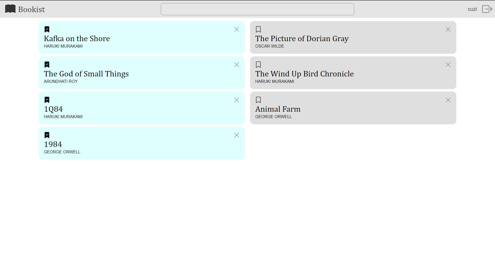
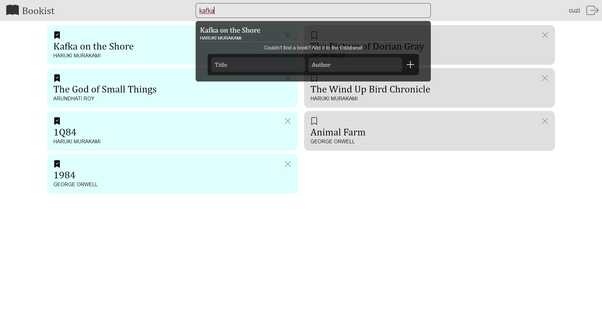
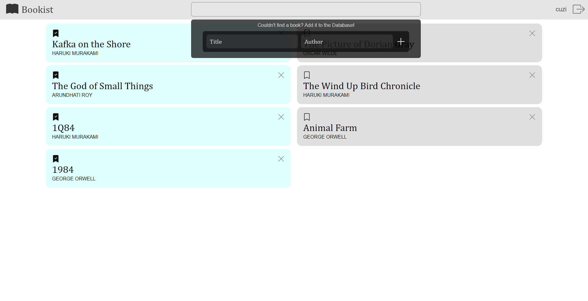

# Bookist: Full Stack App with PostgreSQL as Backend
## A web application for keeping a bucket list of books to be read
Users can add books to their reading list as well as mark them read. A Search Box has been implemented using SQL queries, through which users can search for books in the database.

I developed the backend with ExpressJS, using PostgreSQL for persistence of data. I implemented a search box in the app, which utilizes SQL queries and regular expressions for querying through the database. For authorization, I used JSON Web Tokens. I designed the user interface myself, where I gave the components a translucent background, which made the app look clean and modern. I developed the frontend with ReactJS. I also used React-redux and React-router libraries.

## Features
  - [x] ~~Login/Signup~~
  - [x] ~~Authorization~~
  - [x] ~~List of books which have been finished~~
  - [x] ~~List of books to be read~~
  - [x] ~~Mark a book as finished~~
  - [x] ~~Delete a book from all lists~~
  - [x] ~~Search for books through the database~~
  - [x] ~~Add new book to the database~~
  - [ ] Drag and Drop
  - [ ] View other users' lists
  - [ ] Rearrange books in a list
  
## Gallery
  
  
   
